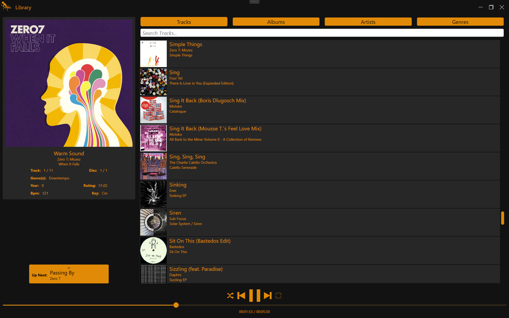
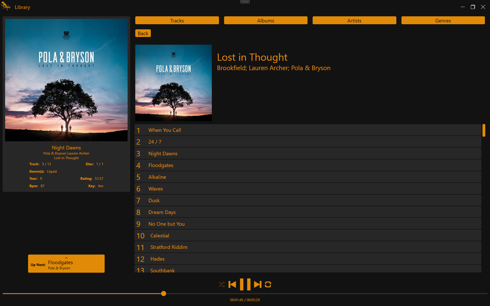
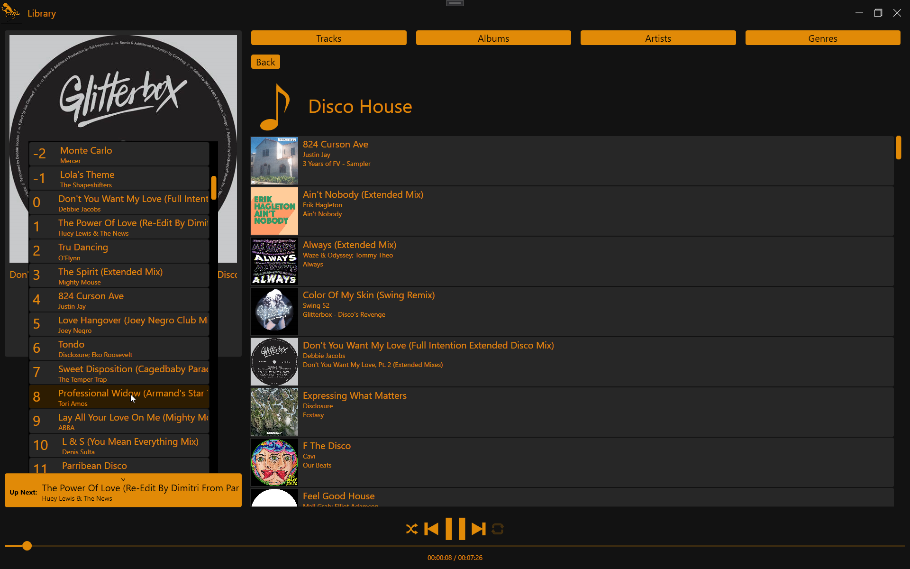
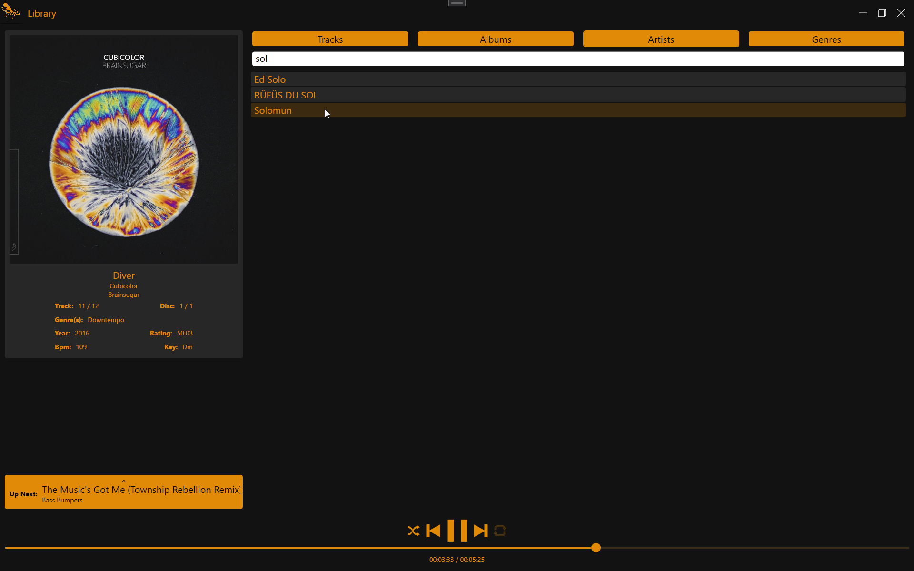
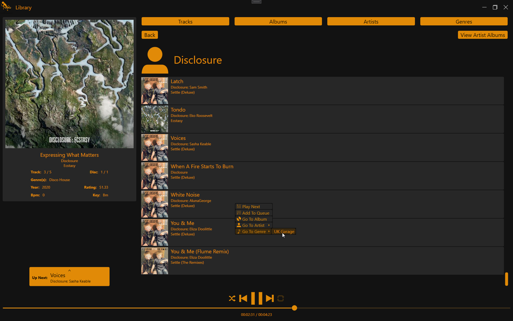
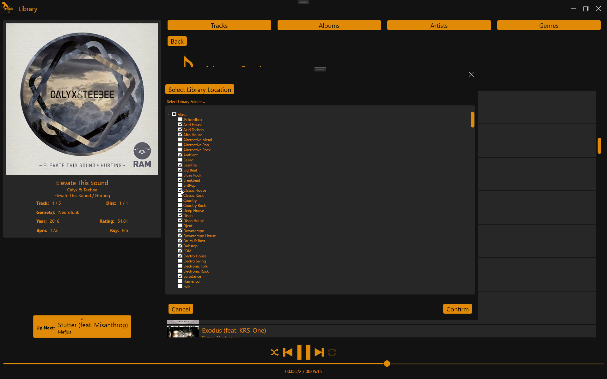

# Octoplayer
A dark theme fullscreen music player. Currently upports .wav .mp3 and .flac file types.

# Screenshots

The library browser and player

Browse by track, album, artist, or genre

View and manage the playing queue to control what tracks are played next

Search within the browser to quickly find matching results

Quickly add to the playing queue or jump to associated pages via the context menu

Easily select library folders via the folder selection interface
